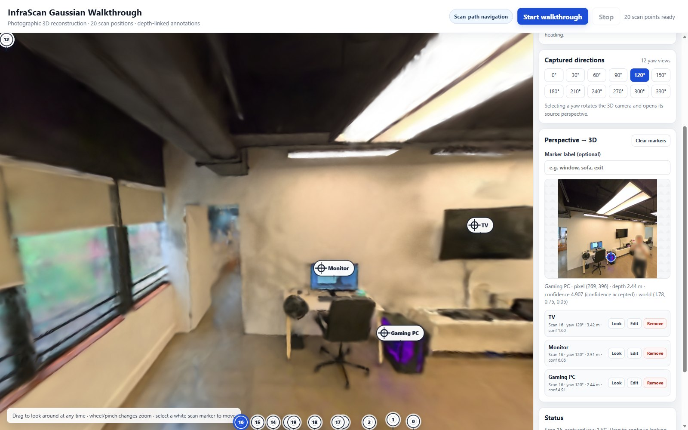
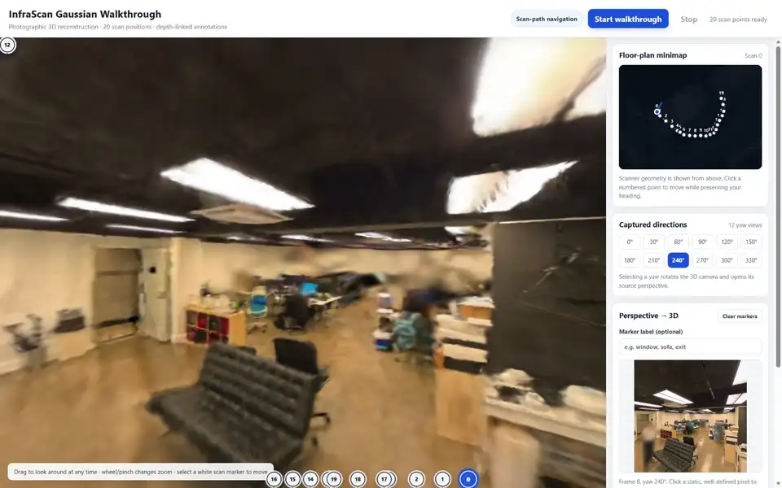
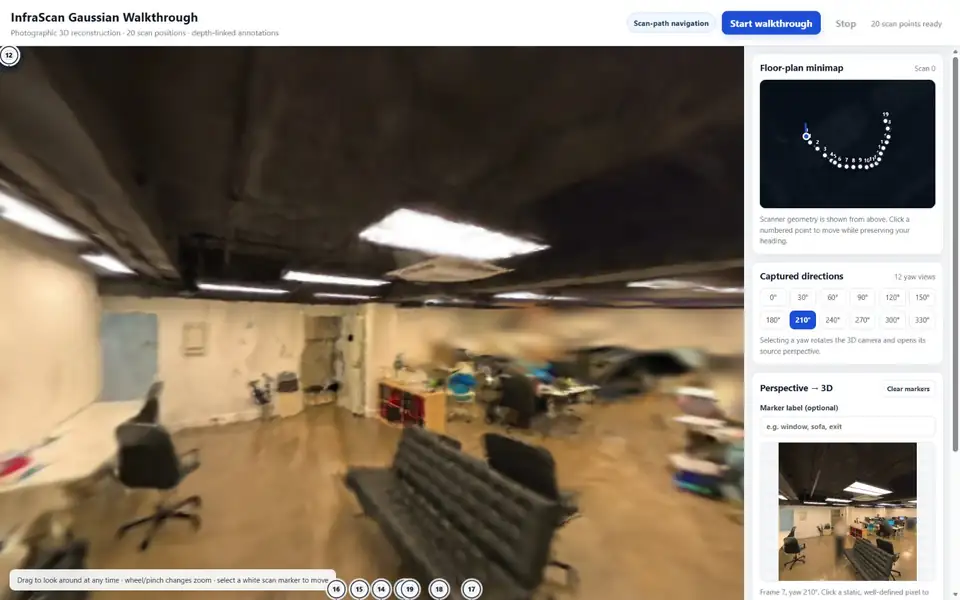
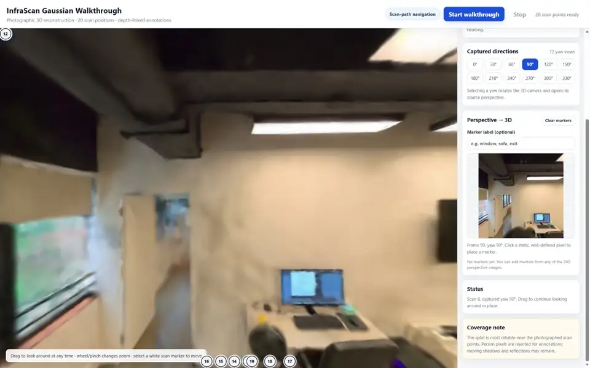
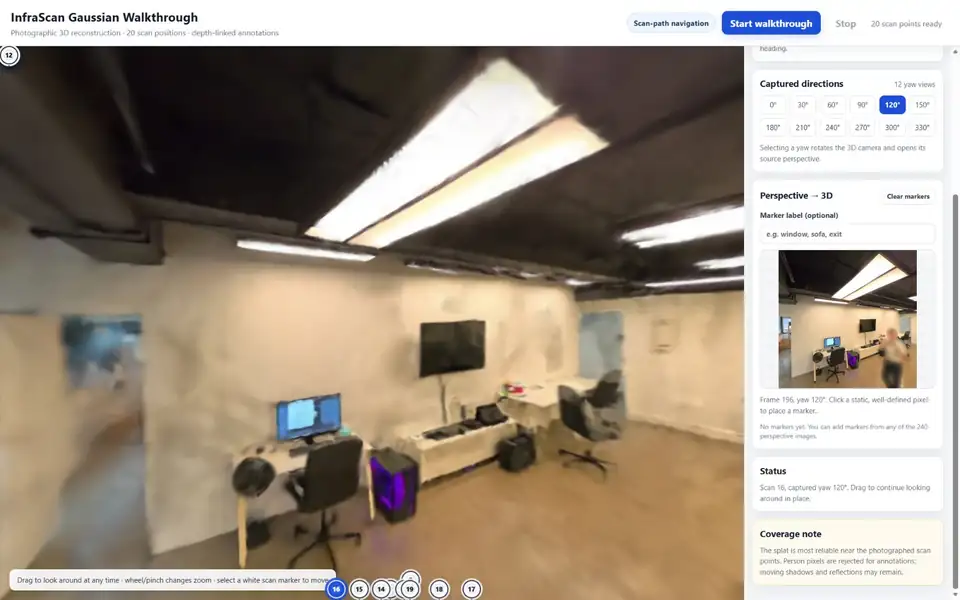
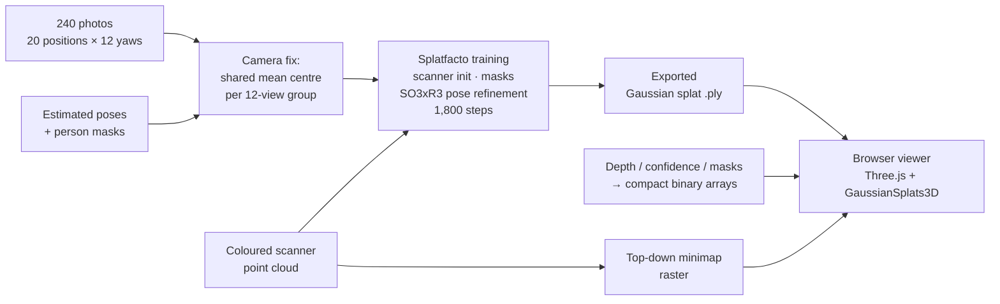
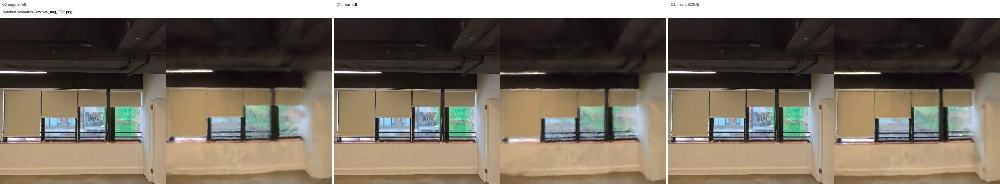
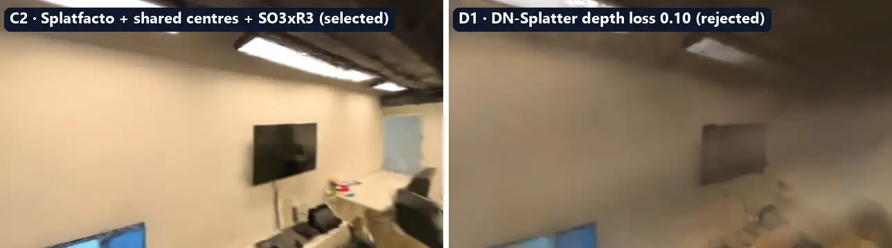
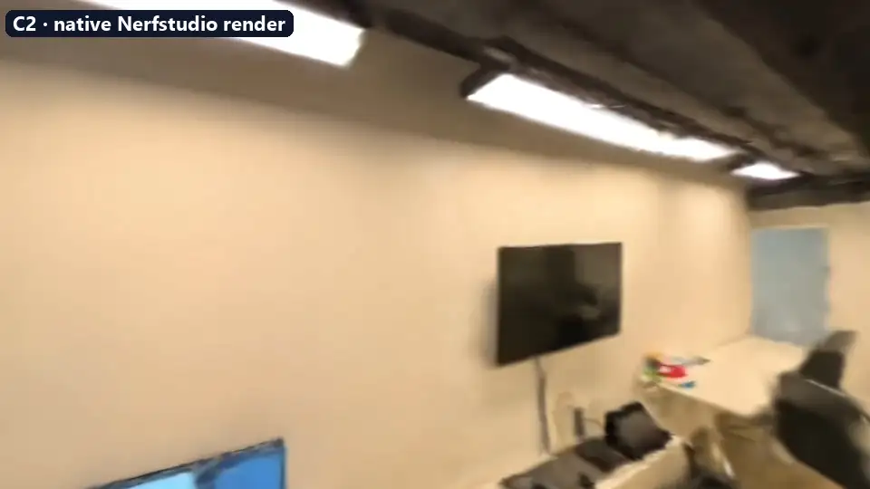
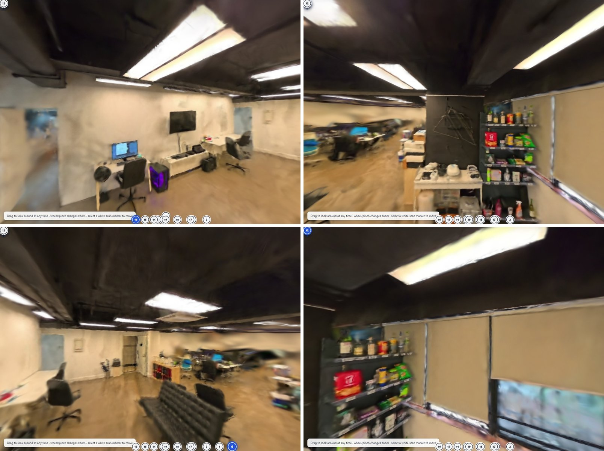

# InfraScan: 3D Scene Reconstruction & Interactive Walkthrough

**Gaussian-splat reconstruction of a real indoor office from 240 photos and a scanner point cloud, explored in a custom browser viewer with guided walkthrough, a synced floor-plan minimap, and depth-linked 3D annotations.**



<p align="center">
  <b>Nerfstudio Splatfacto</b> · <b>3D Gaussian Splatting</b> · <b>Three.js</b> · <b>GaussianSplats3D</b> · <b>Vite</b> · <b>Python / NumPy</b>
</p>

---

## Highlights

- **Photographic 3D reconstruction** of an office floor from 20 scan positions × 12 yaw views (240 images, 504×504), initialised from a coloured scanner point cloud.
- **Camera-pose correction**: the 12 views captured at one spot were treated as a single physical position with a shared centre. This improved all three image metrics before any pose refinement (C0 → C1).
- **Controlled experiments** across camera setups (C0–C3) and alternative methods (DN-Splatter depth supervision, 2DGS, Poisson meshing), with model selection based on LPIPS and novel-view stability, not on one metric alone.
- **Custom web viewer** (~1,600 lines of JS) that turns the splat into an explorable product:
  - guided walkthrough along the captured trajectory, with free look while moving
  - **two-way minimap sync**: click the map to move in 3D, and the map tracks your 3D position and heading live
  - 12 captured directions per scan position, each showing its source photo
  - **drop-tag annotations**: click a pixel in a source photo and it is back-projected through depth, intrinsics and pose into a labelled 3D marker

---

## Features

### Guided walkthrough
Smoothly interpolates between the 20 scan positions along the captured path. You can drag to look around at any time, even during movement. Roll is removed to keep the horizon stable.



### Two-way floor-plan minimap
The minimap is a top-down projection of the scanner point cloud, drawn in the same floor frame as the 3D scene. Clicking a numbered point moves the 3D camera there and keeps your heading. The blue marker and heading line follow the 3D camera in real time.



### Captured directions ↔ source photos
Each scan position exposes its 12 original capture directions. Selecting one rotates the reconstruction to that exact view and opens the source photograph beside it, so you can compare the render against the real photo directly.



### Depth-linked drop-tag annotations
Type a label, then click any static pixel in the source photo. The viewer reads that pixel's depth, confidence and person-mask values and back-projects it into world space:

```
X_world = R · (depth · K⁻¹ · [u, v, 1]ᵀ) + C_scan
```

The labelled marker then stays fixed in the 3D scene as you move and look around. It rejects pixels inside person masks and pixels with unusable depth confidence. Markers can be renamed, re-focused ("Look") or removed.



---

## Reconstruction



### Key insight: one spot, one camera centre
All 12 yaw views at a scan position were captured from the same physical spot, but the estimated poses gave each view slightly different translations. Treating that noise as real camera motion turns one stationary panorama into several displaced cameras. I grouped each set of 12 views, **replaced their translations with one arithmetic-mean centre, and kept their individual rotations**. Window lines, vertical bars, wall edges and the floor boundary all became straighter and more stable:


<sub>Each panel pair: ground-truth photo (left) and render (right). C0 = original poses · C1 = shared mean centres · C2 = shared centres + SO3xR3 pose refinement.</sub>

### Experiments

| ID | Camera / method setup | PSNR ↑ | SSIM ↑ | LPIPS ↓ | Outcome |
|---|---|---:|---:|---:|---|
| C0 | Original per-view centres, optimizer off | 18.29 | 0.713 | 0.452 | Rejected |
| C1 | Shared mean centres, optimizer off | **18.50** | **0.718** | 0.441 | Useful camera correction |
| **C2** | **Shared mean centres + SO3xR3** | 18.20 | 0.712 | **0.362** | ✅ **Selected** |
| C3 | C2 + stronger translation regularisation | 18.25 | 0.714 | 0.367 | No consistent gain |
| D1 | Shared centres + DN-Splatter depth loss 0.10 | 17.24 | 0.695 | 0.406 | Rejected after pilot |
| 2DGS | Shared centres + official 2DGS (10k steps) | 18.68 | 0.724 | 0.389 | Over-smoothed; rejected |

Full table: [`results/experiment_summary.csv`](results/experiment_summary.csv).

**Why C2?** C1 scored slightly higher on PSNR and SSIM, but C2 cut LPIPS by about 18% and looked clearly more coherent along a fixed novel-camera path, which matters most for a walkthrough. 2DGS scored highest on PSNR and SSIM but over-smoothed windows, blinds and ceiling beams. Depth supervision (DN-Splatter) produced holes and collapsing surfaces on this data:



<details>
<summary><b>Native Nerfstudio render of the final C2 model</b> (sharper than the real-time browser renderer)</summary>



</details>

<details>
<summary><b>More views from the browser viewer</b></summary>



</details>

For the full methodology, rejected alternatives and discussion, see the **[project write-up](docs/REPORT.md)**.

---

## Running the viewer

> **Note on data:** the scene data (photos, depth maps, scanner cloud and the trained 130 MB splat) belongs to the dataset provider and is **not included** in this repository. The code is complete; to run it you need the assets in the layout described in [`docs/ASSETS.md`](docs/ASSETS.md). The screenshots and animations above were captured from the running viewer.

**Requirements:** Node.js 20.19+ or 22.12+, a WebGL-capable browser. Python, CUDA and Nerfstudio are *not* needed to run the viewer.

Windows (PowerShell):

```powershell
Set-ExecutionPolicy -Scope Process Bypass
.\setup.ps1          # verifies assets + installs pinned npm dependencies
.\start_viewer.ps1   # optional: -Port 5174
```

macOS / Linux:

```bash
./setup.sh
./start_viewer.sh    # optional: ./start_viewer.sh 5174
```

Then open **http://127.0.0.1:5173**. Manual alternative: `cd viewer && npm ci && npm run dev`.

| Control | Action |
|---|---|
| Drag in 3D view | Look around (works during movement) |
| Wheel / pinch | Field of view |
| Numbered marker or minimap point | Move to that scan position |
| Yaw buttons (0°–330°) | Snap to a captured direction and show its photo |
| **Start walkthrough** | Guided tour along the scan path |
| Click on source photo | Drop a labelled 3D annotation |

---

## Repository structure

```text
├── viewer/                  # Interactive web viewer (Vite + Three.js + GaussianSplats3D)
│   ├── src/
│   │   ├── main.js          # UI, walkthrough, annotation workflow
│   │   ├── viewer.js        # splat rendering, camera control, 3D markers
│   │   ├── minimap.js       # SVG floor-plan minimap, two-way sync
│   │   ├── coordinates.js   # scene frame, pixel → world back-projection
│   │   ├── depth.js         # loads per-frame depth/confidence/mask arrays
│   │   └── data.js          # camera loading and scan grouping
│   ├── scripts/
│   │   ├── preprocess_depth.py   # DA3 .npz → compact .f32/.u8 arrays for the browser
│   │   └── generate_minimap.py   # scanner PLY → top-down floor-plan raster
│   └── public/              # scene assets (git-ignored, see docs/ASSETS.md)
├── pipeline/
│   ├── scripts/             # dataset preparation, training & export helpers
│   ├── configs/reference/   # Nerfstudio configs of the recorded experiments
│   └── environment/
├── results/                 # experiment metrics
├── docs/
│   ├── REPORT.md            # full project write-up
│   ├── ASSETS.md            # expected data layout
│   ├── media/               # README screenshots & animations
│   └── early-dn-splatter-*  # notes from the first (rejected) DN-Splatter approach
├── setup.ps1 / setup.sh
├── start_viewer.ps1 / start_viewer.sh
└── verify_assets.mjs        # checks the model, cameras, images and depth assets
```

---

## Limitations & next steps

- Quality is strongest near the 20 scan positions. Floors and ceilings are weakly constrained because every image has the same horizontal pitch.
- Person masks stop people being baked into the scene, but cannot recover the background hidden behind them, or remove shadows and reflections.
- The real-time browser renderer is softer than native Nerfstudio rendering. Annotations are session-local.
- **Next:** broader controlled sweeps (pose-refinement constraints, densification, per-view weighting, confidence-filtered depth); browser quality presets (DPR, antialiasing, splat scale); persistent annotations; an automated browser smoke test. With new capture, up- and down-tilted views would constrain the floor and ceiling.

---

<sub>Built by Kemelbay Mariyam. Dataset provided by InfraScan for this reconstruction task.</sub>
