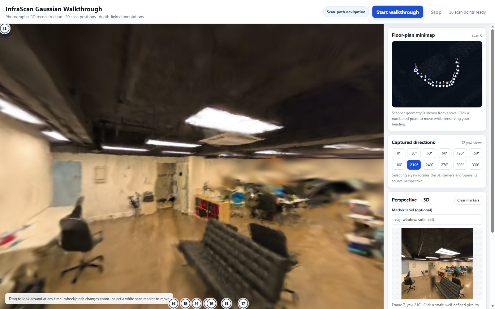

# InfraScan 3D Reconstruction and Interactive Walkthrough

*Camera correction, reconstruction experiments, and browser deployment. Kemelbay Mariyam*

This write-up covers the main reconstruction decisions, the controlled
experiments, rejected alternatives, implementation choices, and the final
interactive walkthrough. ([← back to README](../README.md))

## 1. Project goal and main challenges

The goal was to turn the provided scanner output into a 3D reconstruction that
could be explored in an interactive browser viewer. The dataset contained a
coloured scanner point cloud, 240 perspective images, estimated camera poses,
depth and confidence maps, and person masks. The images were captured from 20
physical scan positions, with 12 horizontal yaw views at each position.

The reconstruction had to work at the original viewpoints and also while moving
between them. I therefore evaluated models with held-out image metrics, matched
visual comparisons, and a fixed novel-camera path.

The dataset had several challenges:

- low image resolution (504 × 504);
- all views at a single horizontal pitch;
- perspective cameras covering only a small part of the much larger scanner cloud;
- moving people, shadows and reflections, which violate the static-scene
  assumption of Gaussian splatting.

*Figure 1. Final browser viewer: floor-plan minimap, scan controls, captured directions and the annotation panel.*

## 2. Selected reconstruction approach

The main method was **Splatfacto** Gaussian splatting (Nerfstudio). The
Gaussians were initialised from the coloured scanner point cloud instead of
randomly. The perspective images supplied the photographic appearance, and
inverse person masks stopped blurred people from supervising the static
reconstruction.

The biggest problem was the camera representation. The 12 yaw views at one
scan position were physically captured from the same location, but the
estimated DA3 poses had small translation differences between them. Treating
these differences as real movement turned one stationary panoramic capture
into several displaced cameras.

I therefore grouped the 12 views at each scan point and **replaced their
translations with one arithmetic-mean shared centre, keeping their individual
rotations**. This matches the physical capture process: one position, 12 viewing
directions.

Final configuration:

- arithmetic-mean shared camera centres
- scanner point-cloud initialisation
- inverse person masks
- full-resolution images
- SO3xR3 pose refinement
- 1,800 training steps

I also ran a continuation to 2,100 steps. At 2,100 steps LPIPS improved from
0.3620 to 0.3498 compared with the same run's 1,800-step checkpoint, but PSNR
fell from 18.126 to 17.971 and SSIM from 0.7087 to 0.7047. (This comparison is
separate from the controlled C0–C2 experiment below.) Training longer with the
same configuration did not clearly improve overall quality within the tested
range. This limited comparison cannot show whether the remaining quality
ceiling comes mainly from the data, the camera calibration, the training
settings or the method.

## 3. Camera experiments and model selection

Three camera configurations were compared with all other training settings fixed:

| ID | Camera configuration | PSNR ↑ | SSIM ↑ | LPIPS ↓ |
|---|---|---:|---:|---:|
| C0 | Original per-view translations; no pose refinement | 18.287 | 0.7127 | 0.4523 |
| C1 | Shared arithmetic-mean centres; no pose refinement | **18.498** | **0.7178** | 0.4414 |
| C2 | Shared mean centres with SO3xR3 pose refinement | 18.197 | 0.7117 | **0.3623** |

Moving from C0 to C1 improved all three metrics. This supports the assumption
that the translation differences within each group were mainly pose-estimation
noise, not real camera movement.

The visual comparison also showed structural improvements. In C0, the line
below the windows, the floor-wall boundary, the vertical window bars and the
right wall were less regular. These became straighter and more stable with
shared camera centres.

C2 slightly reduced PSNR and SSIM compared with C1, but improved LPIPS
substantially and looked more coherent along the fixed novel-camera path. The
pose optimiser was useful even though it did not maximise every metric. A more
strongly constrained variant, **C3**, looked very similar to C2 with no
consistent improvement, so **C2 was selected** as the final model.

*Figure 2. Matched comparison of C0, C1 and C2 (each pair: photo, then render). Look at the lower window line, vertical bars, right wall and floor boundary.*

## 4. Dynamic people and other reconstruction methods

The person masks worked well in the selected model: the masked person was not
reconstructed as a permanent person-shaped object. Masking cannot recover the
background hidden behind a person, though, and it does not remove shadows,
reflections or lighting changes.

This was more visible in some alternative reconstructions. In the 2DGS result,
blurred blobs remained in regions affected by people and missing supervision.
These are more likely caused by hidden background, nearby shadows, mask
boundaries and inconsistent observations than by the people themselves being
reconstructed. Some blur near the monitor and chair probably has similar
causes, together with the limited image resolution and camera coverage.

The alternative methods were limited **pilot experiments**, not exhaustive
hyperparameter studies:

- **DN-Splatter (depth-supervised splatting):** two depth-loss weights (0.10 and
  0.02). It produced white gaps, disappearing surfaces and unstable geometry,
  even at the lower weight.
- **Poisson mesh:** two combinations of filtering and reconstruction settings.
  The meshes stayed rough and incomplete and were less suitable for a walkthrough.
- **2D Gaussian Splatting:** one main 10,000-step configuration. It achieved
  the highest PSNR and SSIM, but its renders were noticeably over-smoothed around
  windows, blinds, ceiling beams and wall boundaries.

*Figure 3. The same novel-camera path rendered by C2 (left) and by DN-Splatter with depth loss (right).*

None of the alternatives produced stable enough novel views in these first
tests, so I focused the remaining time on the Splatfacto camera experiments and
the viewer. These results are exploratory evidence from the settings tested.
They do not show that these methods cannot work for this kind of scene, and
they do not establish whether the remaining quality limit comes from the source
data, residual calibration error, insufficient tuning or the method family.

## 5. Interactive walkthrough

The final C2 reconstruction is integrated into a custom browser viewer built as
a small web project. **Vite** is the dev server and bundler, **Three.js**
handles the scene and camera, and **GaussianSplats3D** renders the exported
splat in real time. The JavaScript is split into focused modules for
rendering, data loading, coordinate conversion, depth handling, minimap
synchronisation and UI control.

The viewer has 20 numbered scan positions. You move between them by clicking
the floor markers or the synced minimap. Movement deliberately follows the
captured trajectory, because that region has the strongest photographic support.

The automatic walkthrough smoothly interpolates between scan positions, and you
can keep dragging to look around while it runs. Camera roll is removed to keep
the view stable, and the mouse wheel or a pinch adjusts the field of view. At
each scan position, 12 yaw controls match the original captured directions.
Selecting one rotates the reconstruction to that view and shows the source photo.

The minimap's background is a top-down projection of the scanner cloud. It
shows the scan trajectory, current position and viewing direction. It also
makes clear that the perspective images cover only part of the full scanner
cloud.

*Figure 4. Moving along the scan trajectory with the synced minimap.*

The viewer also supports **depth-linked 3D annotations**. A pixel selected in a
source photo is back-projected using the image depth, the camera intrinsics and
the pose. The resulting marker appears in the 3D scene, where it can be
labelled, edited or removed. Pixels inside person masks, and pixels with
unusable depth confidence, are rejected.

*Figure 5. Depth-linked annotations placed from a source photo into the 3D scene.*

## 6. Rendering quality, limitations and next steps

The C2 checkpoint was rendered both natively in Nerfstudio and in the browser
viewer. The native path render keeps more detail and looks sharper. The browser
viewer uses a real-time JavaScript renderer and prioritises interactivity, UI
integration and compatibility, so its output is somewhat softer. Both use the
same reconstruction; the difference comes from the renderer and deployment
environment.

*Figure 6. The C2 model rendered natively by Nerfstudio.*

**Limitations**

- Quality is strongest near the 20 captured scan positions.
- Floor and ceiling are less constrained because every image has the same
  horizontal pitch.
- Person masks remove people but not their shadows, reflections or the hidden
  background.
- Reliability drops outside the photographed region of the scanner cloud.
- Annotations last only for the current session. Loading the full splat can be
  slow on devices with limited memory or integrated graphics.

**With another week**

1. Run broader controlled reconstruction experiments instead of only extending
   one training run: pose-refinement constraints and learning rates,
   densification and regularisation settings, down-weighting weak source views,
   and confidence- and cross-view-consistency filtering before using depth as
   supervision. Evaluate at least one alternative method more systematically.
2. Profile browser rendering: resolution, device-pixel ratio, antialiasing,
   splat scale, opacity and quality-versus-performance presets. Improve loading
   feedback and error reporting.
3. Add an automated browser smoke test covering model loading, scan navigation,
   yaw selection, minimap sync and annotation placement.
4. With new capture: add upward- and downward-facing images to better constrain
   the floor and ceiling.

Overall, C2 gave the best balance of perceptual quality, structural stability
and usability. The shared-centre correction matched the real capture process,
pose refinement improved novel-view behaviour, and the viewer ties the
reconstruction to the scan trajectory, the source photos, smooth navigation and
depth-linked annotations.
